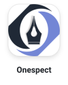
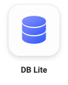
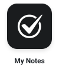
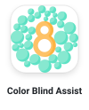

# 👋 Hi, I’m [Ankit](#)

Building for iOS is what excites me most. I enjoy working with Swift and SwiftUI, exploring Apple's frameworks, and creating applications that are simple, reliable, and enjoyable to use.

 

## 📱 Projects

  
  
  
  
  
  

